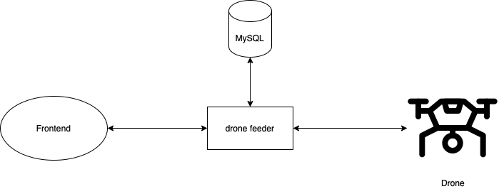

# Boas vindas ao repositório do desafio da Aceleração em Java

O tema escolhido para esse desáfio foi o Drone Feeder

# Sumário

- [Contexto](#contexto)
- [Tecnologias](#tecnologias)
- [Dependências](#dependências)
- [Como rodar a aplicação](#como-rodar-a-aplicação)
- [Como rodar os testes](#como-rodar-os-testes)
- [Documentação da API](#documentação-da-api)
  - [Drone](#drone)
  - [Delivery](#delivery)
  - [Video](#video)
- [Próximos passos](#Próximos-passos)
- [Autores](#autores)


# Contexto 

A empresa "FutuereH" conseguiu uma nova patente que permitirá a entrega de pacotes com drones. Isso mesmo: o futuro já chegou para FutuereH! Com essa patente registrada, a empresa tem ao todo três meses para iniciar os testes. Sua equipe é responsável por montar o serviço Back-end, que vai fornecer informações aos drones.

Depois de muitas discussões entre os arquitetos e o CTO da empresa, o Back-end foi batizado como Drone Feeder. A Stack escolhida para a criação dele foi a linguagem Java, o banco de dados MySQL, e tudo deve rodar em containers Docker.

A arquitetura da parte do sistema em que o Drone Feeder vai atuar foi entregue à sua equipe pelo CTO e seus arquitetos com o seguinte desenho:



Confome visto, o Drone Feeder será uma aplicação REST em que um sistema Front-end vai exibir algumas informações dos drones, tais como latitude e longitude, data e horário da entrega ou retirada do pacote. Essas informações serão armazenadas no banco de dados MySQL.

O drone, por sua vez, sincronizará informações com o Drone Feeder sempre que ele tiver uma conexão com a internet. O drone ainda vai informar se a entrega foi efetuada junto a data, horário e vídeo gravado do momento da entrega.

O CTO da FutuereH confia muito na sua equipe e deu liberdade para eventuais melhorias e modificações na arquitetura proposta.

# Tecnologias

**Back-end:** 
- Java
- SpringBoot
- MySql
- Docker

# Dependências

- spring-boot-starter-data-jpa
- spring-boot-starter-web
- spring-boot-devtools
- h2database
- mysql-connector-java
- spring-boot-starter-test

# Como rodar a aplicação

Clone o repositorio

```bash
  git@github.com:nataelienai/drone-feeder.git
```

Entre no diretório

```bash
  cd drone-feeder
```

Instale as dependências e rode a aplicação

```bash
  mvn install 
```

## Documentação da API

## **Drone**

#### Cria o drone

```http
  POST /drone
```

| Parâmetro   | Tipo       | Descrição                                   |
| :---------- | :--------- | :------------------------------------------ |
| `null` | `null` | **Não é obrigatório** |

#### Retorna todos os items

```http
  GET /drone
```

| Parâmetro   | Tipo       | Descrição                                   |
| :---------- | :--------- | :------------------------------------------ |
| `null` | `null` | **Não é obrigatório** |

#### Retorna um item

```http
  GET /drone/{id}
```

| Parâmetro   | Tipo       | Descrição                                   |
| :---------- | :--------- | :------------------------------------------ |
| `id` | `long` | **Obrigatório**. O ID do item que você quer |

#### Altera um item

```http
  PUT /drone/{id}
```

| Parâmetro   | Tipo       | Descrição                                   |
| :---------- | :--------- | :------------------------------------------ |
| `id` | `long` | **Obrigatório**. O ID do item que você quer |

#### Deleta um item

```http
  DELETE /drone/{id}
```

| Parâmetro   | Tipo       | Descrição                                   |
| :---------- | :--------- | :------------------------------------------ |
| `id` | `long` | **Obrigatório**. O ID do item que você quer |

## **Delivery**

#### Cria o delivery

```http
  POST /
```

| Parâmetro   | Tipo       | Descrição                                   |
| :---------- | :--------- | :------------------------------------------ |
| `null` | `null` | **Não é obrigatório** |

#### Retorna todos os items

```http
  GET /
```

| Parâmetro   | Tipo       | Descrição                                   |
| :---------- | :--------- | :------------------------------------------ |
| `null` | `null` | **Não é obrigatório** |


#### Altera um item

```http
  PUT /{id}
```

| Parâmetro   | Tipo       | Descrição                                   |
| :---------- | :--------- | :------------------------------------------ |
| `id` | `long` | **Obrigatório**. O ID do item que você quer |

#### Altera um drone

```http
  PUT /{id}/{droneId}
```

| Parâmetro   | Tipo       | Descrição                                   |
| :---------- | :--------- | :------------------------------------------ |
| `id, droneId` | `long` | **Obrigatório**. O ID do item que você quer |

#### Deleta um item

```http
  DELETE /{id}
```

| Parâmetro   | Tipo       | Descrição                                   |
| :---------- | :--------- | :------------------------------------------ |
| `id` | `long` | **Obrigatório**. O ID do item que você quer |

## **Video**

#### Retorna todos os videos

```http
  GET /video
```

| Parâmetro   | Tipo       | Descrição                                   |
| :---------- | :--------- | :------------------------------------------ |
| `null` | `null` | **Não é obrigatório** |


#### Envia um item

```http
  POST video/upload/delivery/{deliveryId}
```

| Parâmetro   | Tipo       | Descrição                                   |
| :---------- | :--------- | :------------------------------------------ |
| `deliveryId` | `file` | **Obrigatório**. O video que você quer |

#### Faz o donwload do arquivo

```http
  GET /download/{id}
```

| Parâmetro   | Tipo       | Descrição                                   |
| :---------- | :--------- | :------------------------------------------ |
| `id` | `long` | **Obrigatório**. O ID do item que você quer |

# Próximos passos

* Deploy 

* Implementar o Front-End

* Swagger 

* Implementar arquitetura de microsserviços

# Autores

[<br><sub>Felipe Vahia</sub>](https://github.com/felipemalli) | [<br><sub>Natã Elienai</sub>](https://github.com/nataelienai) |  [<br><sub>Raphael</sub>](https://github.com/Raph2ll) |
| :---: | :---: | :---: |